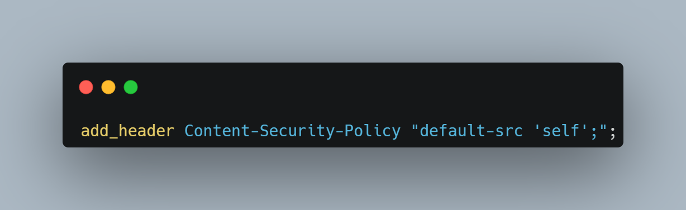

Content Security Policy Demo Starter Files

# 網站防身術之 內容安全政策(CSP) 防護

## 常見的網站安全漏洞

**攻方的手段**
- 常見注入型弱點： **XSS**、 **SQL injection** 、Command injection、Code injection
- Session 相關弱點：Session 劫持、Session 固定
- 前端相關弱點：**CSRF**、點擊劫持、DOM base、
- 進階弱點：SSRF、XXE、Insecure Deserialization、WebSockets

## XSS

type:
- 反射型 (Reflected) : 通常是將惡意程式會藏在網址列裡

    `http://www.example.com/upload.asp?id=<script>alert(1);</script>`
    ```html
        <h2 id="title"></h2>
        <script>
            localStorage.setItem('token', 'I\'m Token')
            const title = document.querySelector('#title')
            title.innerHTML = (new URL(location).searchParams.get('q'))
        </script>
    ```

- 儲存型 (Stored) : 攻擊的方式是 Hacker 將 Javascript 儲存在伺服器的資料庫中，進而引起使 User 遭受攻擊

    ``

- DOM : 使 User 點擊 URL 攻擊才會生效

    `我是壞人！ <script>alert(1);</script>`

Demo XSS

防禦手法:
- 驗證使用者輸入的資訊
- 設定 Cookie
- **設定 Http-Header > CSP**

## CSP 防護

CSP 是瀏覽器提供網站設定白名單的機制，網站可以告知瀏覽器，該網頁有哪些位置可以連、哪些位置不能連

- CSP 主要是用來防護減少 XSS 的攻擊
- 透過設定 CSP 執行有效來源(origin)的 script，避免執行非有效來源的 script
  
### 來源(origin)

origin 的組成：scheme + host + port 

scheme
host
port 

## CSP 怎麼設定

設定:
- 後端設定 http-header
  
  以 Node.js 為例
    
  
- 前端設定 meta

  透過 HTML `meta` 標籤
    

- 伺服器 IIS、nginx
    
## CSP 指令

### 常見指令
- default-src 預設所有類型的載入都使用這個規則。
- connect-src 載入 Ajax、Web Socket 套用的規則。
- font-src 載入字型套用的規則。
- frame-src 載入 IFrame 套用的規則。
- img-src 載入圖片套用的規則。
- media-src 載入影音標籤套用的規則。如：`<audio>`、`<video>` 等。
- object-src 載入非影音標籤物件套用的規則。如：`<object>`、`<embed>` 等。
- script-src 載入 JavaScript 套用的規則。
- style-src 載入 Stylesheets (CSS) 套用的規則。

### 指令可設定的參數
每個 CSP 指令可以限制一個或多個能發出 Request 的位置，設定參數如下：

- '*'
允許對任何位置發出 Request。
如：default-src *;，允許載入來自任何地方、任何類型的資源。
- 'none'
不允許對任何位置發出 Request。
如：media-src 'none';，不允許載入影音標籤。
- 'self'
只允許同網域的位置發出 Request。
如：script-src 'self';，只允許載入同網域的 *.js。
- URL
指定允許發出 Request 的位置，可搭配 * 使用。
如：img-src http://cdn.johnwu.cc https:;，只允許從 http://cdn.johnwu.cc 或其他 HTTPS 的位置載入 *.css。


## Live Demo Time

https://www.digitalocean.com/community/tutorials/how-to-secure-node-js-applications-with-a-content-security-policy
https://ithelp.ithome.com.tw/articles/10196896


